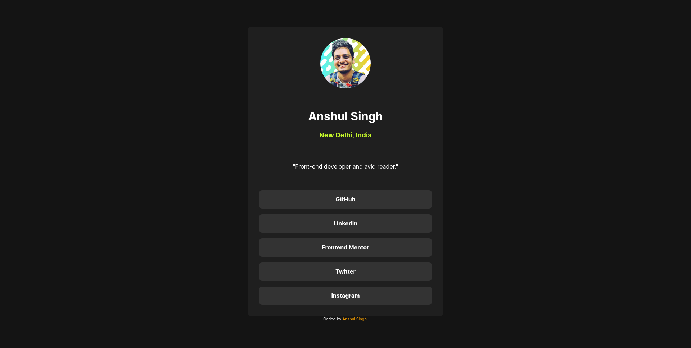
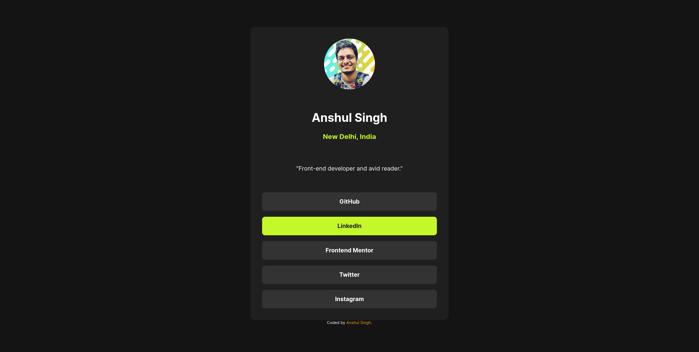
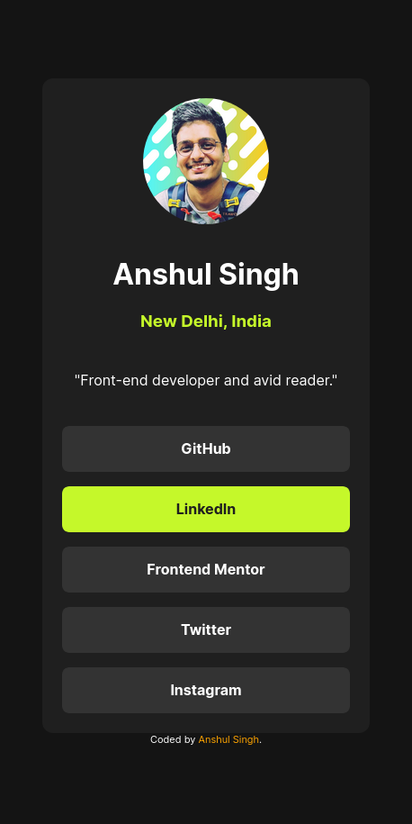

# Frontend Mentor - Social links profile solution

This is a solution to the [Social links profile challenge on Frontend Mentor](https://www.frontendmentor.io/challenges/social-links-profile-UG32l9m6dQ). Frontend Mentor challenges help you improve your coding skills by building realistic projects.

## Table of contents

- [Overview](#overview)
  - [The challenge](#the-challenge)
  - [Screenshot](#screenshot)
  - [Links](#links)
  - [Built with](#built-with)
  - [What I learned](#what-i-learned)
  - [Continued development](#continued-development)
  - [Useful resources](#useful-resources)
- [Author](#author)

**Note: Delete this note and update the table of contents based on what sections you keep.**

## Overview

### The challenge

Users should be able to:

- See hover and focus states for all interactive elements on the page

### Screenshot

### Links

- Solution URL: [https://github.com/nshulsingh3/quick-brush-up](https://github.com/nshulsingh3/quick-brush-up)
- Live Site URL: [https://admirable-zabaione-9e0761.netlify.app](https://admirable-zabaione-9e0761.netlify.app)

### Built with

- CSS custom properties
- Flexbox
- CSS Grid
- Mobile-first workflow
- Media Queries

### What I learned

By default body tag has some border present.

It is different for different browsers.

This issue got highlighted when I noticed a scroll bar coming after giving 100vh height to the parent div.

### Useful resources

- [Vertical scroll bar on 100vh](https://stackoverflow.com/questions/44645465/when-using-height-100vh-for-the-container-vertical-scrollbar-appears) - This helped me for eliminating the scroll bar on my page.

## Author

- Website - [Anshul Singh](https://marvelous-macaron-a3a105.netlify.app/)
- Frontend Mentor - [@nshulsingh3](https://www.frontendmentor.io/profile/nshulsingh3)
- Twitter - [@nshulsingh3](https://www.twitter.com/nshulsingh3)
